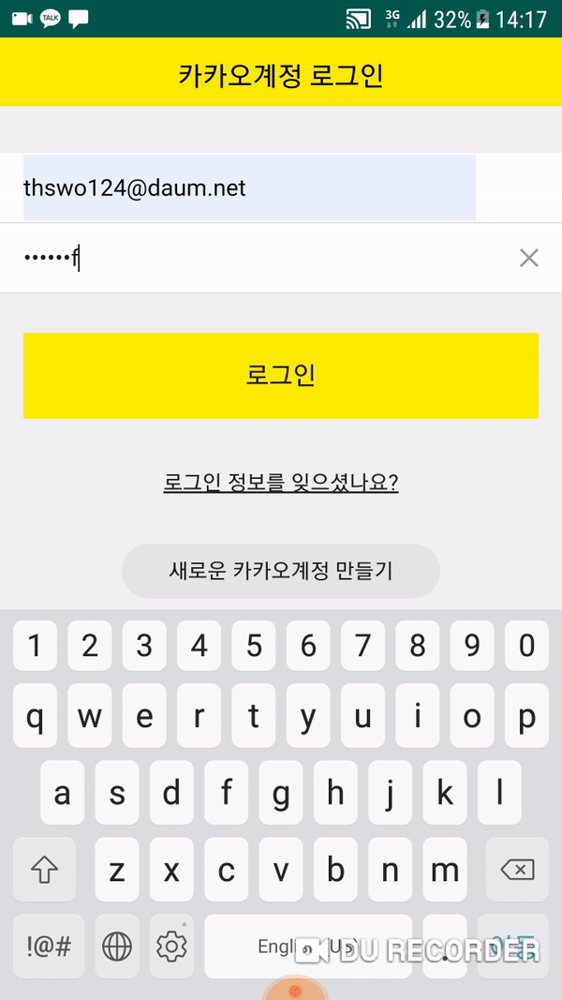

# KaKaoLogin
</img>

# Project 구현방법

* 카카오 Key 등록
* 카카오 관리자 API 연동
* Kakao Adapter Implement
* 세션인증(Session Authion)
* 결과반환(Result)

# 결과
## **카카오 간편 로그인**
 
</img>  
 
 
간편 로그인 버튼을 클릭시
실제 내카카오계정의 세션을 통해 간편하게 로그인을 합니다.

## **카카오 다른아이디 로그인**
 
</img>  
 
 
다른계정으로 로그인 버튼을 클릭시
다른 계정의 아이디,패스워드 인증(Auth) 통해 로그인을 합니다.

~~(아이디와 비밀번호를 가리기 위해 영상을 조금 잘랐습니다 양해부탁드려요.)~~

## **프로젝트 구조도**
**빨간부분이 변경해야하는 부분입니다.**  

## **매니페스트**  
**밑줄부분에 키 값 삽입**

## **프로젝트 Gradle**
**빨간부분이 추가해야하는 부분입니다.**

## **모듈 Gradle**
**빨간부분이 추가해야하는 부분입니다.**

## **Properties Gradle**
**빨간부분이 추가해야하는 부분입니다.**

